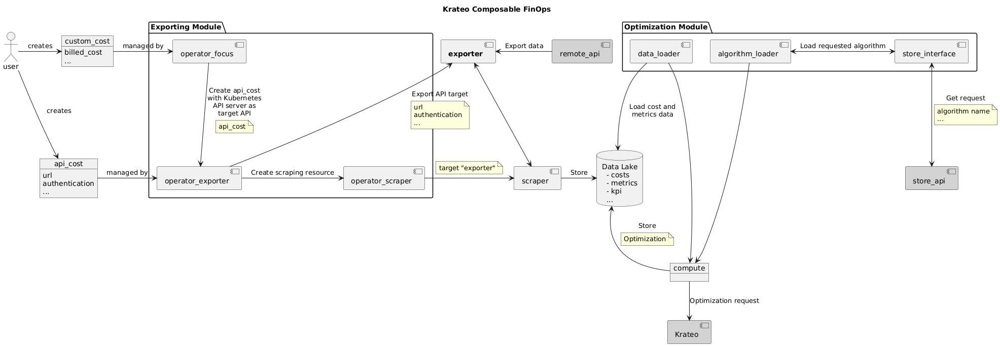

# FinOps Prometheus Resource Exporter (Resources)
This repository is part of the wider exporting architecture for the Krateo Composable FinOps and exports the API endpoints of resources to obtain usage metrics, exposed in the Prometheus format.

## Summary
1. [Overview](#overview)
2. [Architecture](#architecture)
3. [Configuration](#configuration)

## Overview
This component is tasked with exporting in the Prometheus format the metrics of resources found in a FOCUS report. The metrics are obtained through an API call to a service provider metrics server. The exporter runs on the port 2112. 

## Architecture


## Configuration
This container is automatically started by the FinOps Operator Exporter.

To build the executable: 
```
make build REPO=<your-registry-here>
```

To build and push the Docker images:
```
make container REPO=<your-registry-here>
```